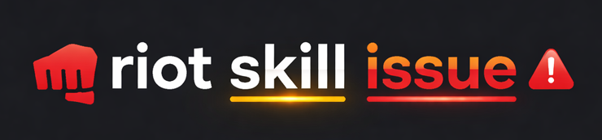

# RiotSkillIssue

<div align="center">




[](https://badge.fury.io/py/riotskillissue)
[](https://pypi.org/project/riotskillissue/)
[](LICENSE)
[](https://github.com/Demoen/riotskillissue/actions/workflows/test.yml)

**Production-ready, auto-updating, and fully typed Python wrapper for the Riot Games API.**

[Documentation](https://demoen.github.io/riotskillissue/) · [Examples](https://demoen.github.io/riotskillissue/examples/) · [API Reference](https://demoen.github.io/riotskillissue/api-reference/)

</div>

---

## Features

| Feature | Description |
|---------|-------------|
| **Type-Safe** | 100% Pydantic models for all requests and responses |
| **Auto-Updated** | Generated daily from the Official OpenAPI Spec |
| **Sync & Async** | First-class async client and a synchronous `SyncRiotClient` for scripts & notebooks |
| **Resilient** | Automatic `Retry-After` handling, exponential backoff, and a rich error hierarchy |
| **Distributed** | Pluggable Redis support for shared rate limiting and caching |
| **Multi-Game** | Full support for LoL, TFT, LoR, and VALORANT APIs |

## Installation

Requires Python 3.8+.

```bash
pip install riotskillissue
```

Set your API key via environment variable:

Linux/MacOS
```bash
export RIOT_API_KEY="RGAPI-your-key-here"
```
Windows (Powershell)
```bash
$env:RIOT_API_KEY = "RGAPI-your-key-here"
```

Windows (CMD)
```bash
set RIOT_API_KEY=RGAPI-your-key-here
```


## Documentation

Full documentation is available at [demoen.github.io/riotskillissue](https://demoen.github.io/riotskillissue/).

- [Getting Started](https://demoen.github.io/riotskillissue/getting-started/)
- [Configuration](https://demoen.github.io/riotskillissue/configuration/)
- [Examples](https://demoen.github.io/riotskillissue/examples/)
- [API Reference](https://demoen.github.io/riotskillissue/api-reference/)
- [CLI](https://demoen.github.io/riotskillissue/cli/)

## Legal

RiotSkillIssue is not endorsed by Riot Games and does not reflect the views or opinions of Riot Games or anyone officially involved in producing or managing Riot Games properties. Riot Games and all associated properties are trademarks or registered trademarks of Riot Games, Inc.

## License

MIT. See the [LICENSE](LICENSE) file for details.
